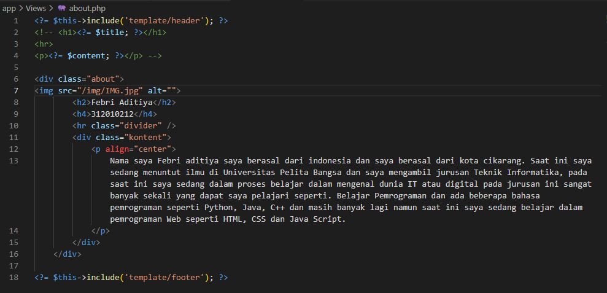
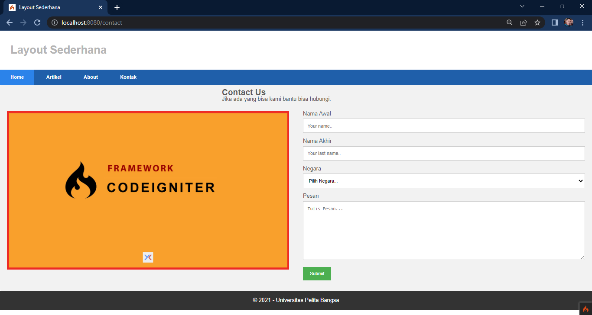
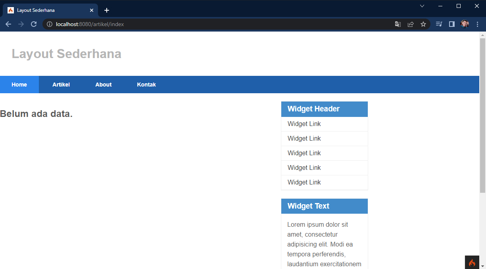
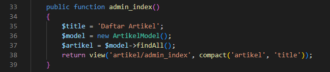

## Febri Aditiya
## 312010212
## TI.20.A2

# Lab11Web
Paraktikum 11 PHP Framework (codeigniter)

### Pertama membuat file home.php di app/controllers/home.php

### Lalu membuat file home.php di app/controllers/page.php

### Membuat folder template di dalam view kemudian buat file header.php app/view/template/header.php

### Membuat file footer.php di app/view/template/footer.php

### Membuat file widget.php di app/view/template/widget.php

### Membuat file box.php di app/view/template/box.php

### Membuat file divider.php di app/view/template/divider.php

### Membuat file home.php di app/view/home.php
*Yang berfungsi untuk meng-include setiap file tersebut.*

### Tampilan hasilnya sebagai berikut.

## Pertanyaan dan Tugas
`Lengkapi kode program untuk menu lainnya yang ada pada Controller page, sehingga semua link pada navigasi header dapat menampilkan tampilan denganlayout yang sama.`

### Membuat File about.php pada app/view/about.php

### tampilan browser nya seperti ini pada menu about

### Membuat File contact.php pada app/view/contact.php

### tampilan browser nya seperti ini pada menu contact

# Praktikum 12: Framework lanjutan (CRUD)
### Intruksi praktikum
1. persiapkan text editor misalnya VSCode.
2. Buka kembali folder dengan nama lab11_php_ci pada docroot webserver (htdocs)
3. Ikuti langkah-langkah praktikumyang akan dijelaskan berikutnya.

### Membuat Database

### Membuat tabel

### Konfigurasi Koneksi Database
`ada dua cara pertama dapat di file app/config/database.php atau bisa juga menggunakan .env`

### Membuat Model
`Buat file di dalam folder models dengan nama ArtikelModel.php`

### Membuat Controller
`Membuat direktori Artikel.php di dalam folder Controller`

### Membuat View
`Buat Direktori baru di dalam folder Views lalu buat file index.php`

`lalu buka browser untuk melihat tampilannya. http://localhost:8080/artikel`

`Kemudian coba tambahkan beberapa data pada databases agar dapat ditampilkan datanya.`

`lalu buka kembali browser untuk melihat hasil tampilannya`

#### Membuat Tampilan Detail Artikel
`pada saat judul berita di klik maka akan diarahkan kehalaman yang berbeda tambahkan fungsi baru pada controller artikel dengan nama view()

### Membuat view detail
`Buat view baru dengan nama app/views/artikel/detail.php`

### Lalu Buat Roating untuk artikel detail
`pada file app/config/Routes.php`

`Lalu buka browser kembali untuk melihat tampilannya`

### Membuat Menu Admin
`menu admin adalah untuk proses CRUD data artikel. Buat method baru pada Controller Artikel dengan nama admin_index()`

`Selanjutnya buat view untuk tampilan admin dengan nama admin_index.php`

`Tambahkan Routing untuk menu admin`

`Untuk akses menu admin dengan url http://localhost:8080/admin/artikel`

### Menambahkan Data Artikel
`Tambahkan fungsi baru  pada Controller Artikel dengan nama add()`

`Kemudian buat view untuk form tambah dengan nama form_add.php`

`Maka tampilannya sebagai berikut`

### Mengubah Data
`Tambahkan fungsi Controller Artikel dengan nama edit()`

`Kemudaian  buat view form tambah dengan nama form_edit.php`

`Hasilnya sebagai berikut`

### Menghapus Data
`Tambah fungsi baru pada Controller Artikel dengan nama delete`

`Maka Tampilan delete nya sebagai berikut`

# Praktikum 13: Frammework lanjutan (Modul Login)
### Intruksi praktikum
1. persiapkan text editor misalnya VSCode.
2. Buka kembali folder dengan nama lab11_php_ci pada docroot webserver (htdocs)
3. Ikuti langkah-langkah praktikumyang akan dijelaskan berikutnya.

### Langkah-langkah Paraktikum 
### Membuat Table User

### Membuat Model User
*Membuat model untuk memproses data login. pada direktori app/Models dengan nama UserModel.php*

### Membuat Controller User
*Buat controller baru dengan nama User.php pada direktori app/Controller*

### Membuat View Login
*Buat direktori baru dengan nama user pada direktori app/view kemudian buat file baru login.php*

### Membuat Database Seeder
*Database seeder digunakan untuk membuat data dummy. Untuk keperluan uji coba modul login, kita perku masukkan data user dan password kedalam database, untuk itu membuat database seeder untuk tabel user. Buka CLI tulis perintah berikut:*

*Selanjutnya buka file UserSeeder.php yang berada di lokasi direktori app/database/seeds/UserSeeder.php kemudian isi dengan ini.*

*Selanjutnya Buka kembali CLI ketik perintah berikut.*

### Uji coba login
*Selanjutnya buka URL https://localhost:8080/user/login seperti berikut.*

### Menambhakan Auth Filter
*Membuat filter untuk halaman admin. Buat file baru dengan nama Auth.php pada direktori app/Filter.*

*Selanjutnya buka file app/Config/Filters.php tambahkan seperti berikut.*

*Selanjutnya buka file app/Config/Routes.php dan sesuaikan kodenya.*

*Selanjutnya buka URL https://localhost:8080/user/login seperti berikut.*

### Fungsi Logout 
*Tambahkan method logout pada Controller User seperti berikut.*

### Pertanyaan Dan Tugas
*Selesaikan Programnya sesuai denga langkah-langkah yang ada. Anda boleh melakukan improvisasi.*